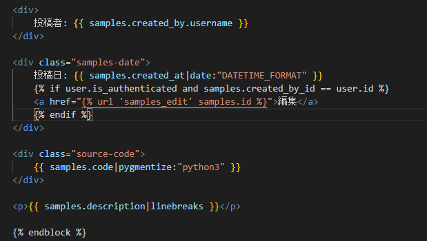
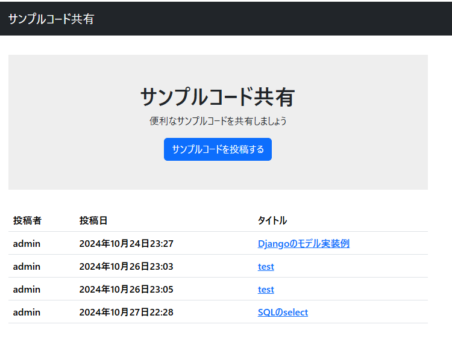
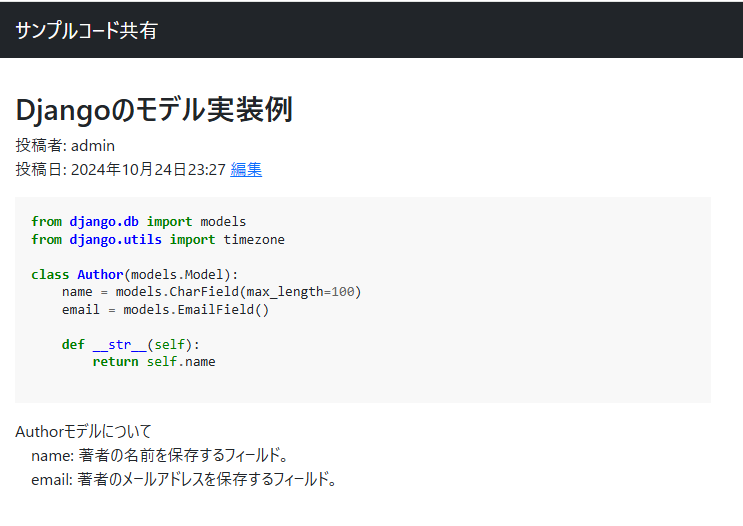

# Portfolio

#### <u>氏名：  伊東　正樹</u>

# <p style="background-color: lightgray;">サンプルコード共有サイト</p>

---
### サービス概要
サンプルコードを共有するサイトです。
<br>

---
### サービスURL
なし

---
### GitHub
[Google先生](https://www.google.co.jp/)
<br>

---
### ソースコードの一部抜粋

<br>

---
### 技術スタック
- Python 3.12.4
- Django 5.1.2
  - django-bootstrap5 24.3
  - Pygments 2.18.0
- SQLite 3
<br>

---
### 機能一覧
- サンプルコード一覧
- サンプルコード詳細
- サンプルコード登録
- サンプルコード編集
<br>

---
### プレビュー
- サンプルコード一覧

- サンプルコード一覧

<br>

---
### 設計図
- サンプル：sample
- 管理ユーザー：auth_user

### ER図

```plantuml
left to right direction
entity "Sample" as sample {
   * id : integer
   --
   created_by_id : integer
   title : text
   code : text
   description : text
   created_by : text
   created_at : datetime
   updated_at : datetime
}

entity "auth_user" as user {
   * id : integer
   --
   password : text
   last_login : date
   is_superuser : bool
   username : text
   first_name : text
   last_name : text
   email : text
   is_staff : bool
   is_active : bool
   date_joined : date
   date_joined : date
   created_by : text
   created_at : date
   updated_at : date
}

user ||..|{ sample

@enduml
```

<br>
<br>
